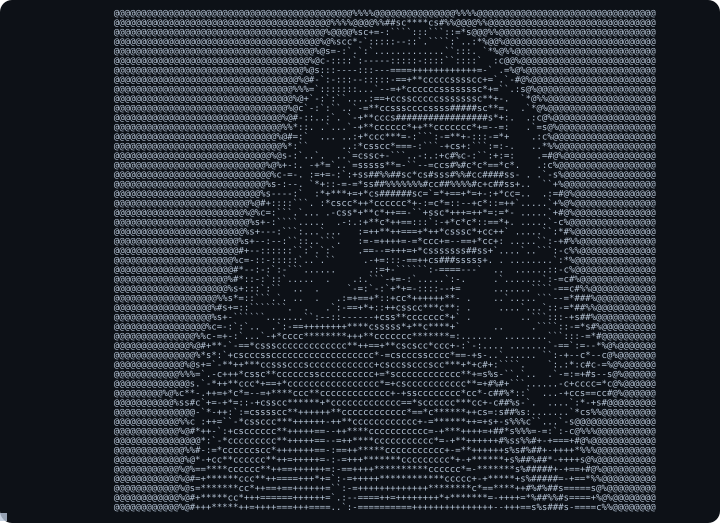

<div align="center">

<br>


</div>

---

## `$ whoami`

```text
Sara Dawood S

B.Tech Artificial Intelligence and Data Science Student
Full-Stack Developer | AI/ML Enthusiast

Building practical software.
Exploring intelligent systems.
Turning ideas into real-world solutions.
```

### `$ cat interests.txt`

* Full-Stack Development
* Artificial Intelligence & Machine Learning
* Generative AI, LLMs & RAG
* Data Science & Analytics
* AI-powered applications
* Modern web technologies

---

## `$ ./contributions.sh`

<div align="center">



</div>

---

## `$ ./ascii_portrait.sh`

<div align="center">



</div>

---

## `$ ls skills/`

### `languages`

<p>

</p>

### `frontend`

<p>

</p>

### `backend`

<p>

</p>

### `ai_ml`

<p>

</p>

### `libraries_frameworks`

<p>

</p>

`Keras` · `XGBoost` · `Hugging Face`

### `genai`

<p>

</p>

`LLMs` · `RAG` · `LangChain` · `LangGraph` · `ChromaDB`

### `data_science`

<p>

</p>

`SciPy` · `Seaborn` · `Plotly`

### `databases`

<p>

</p>

### `cloud_devops`

<p>

</p>

`Render`

### `tools`

<p>

</p>

---

## `$ github --stats`

<div align="center">


</div>

<br>

<div align="center">


</div>

---

## `$ connect --with-me`

<div align="center">

<a href="https://github.com/SaraDawood2004">

</a>

<a href="https://www.linkedin.com/in/sara-s-d-219a5728b/">

</a>

<a href="mailto:mailtosaradawood@gmail.com">

</a>

</div>

---

## `$ ./closing.sh`

<div align="center">


</div>

---

<div align="center">


</div>
